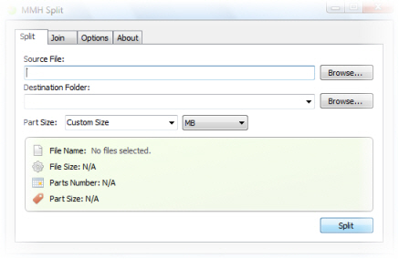

### File Splitter

High-performance binary file splitter, I've written in 2009 with C# and C++.

> :warning: This code is legacy, not maintained and may have a lot of issues.

> :blossom: The main reason for publishing this project that it may be useful for someone to learn from, it has a lot of advanced concepts including Custom GDI+ Components, Threading, Memory Caching, Virtual Memory Mapping, and C++ Win32 Programming.

#### Requirments:

- .Net Framework 2.0
- Visual Studio 2010 or later
- Microsoft Windows SDK

#### Components:

##### 1- MMH Split Project
Main C# application while handles reading source files and split the data and also joining it.




##### 2- Q Join Project
C++ portable self-extractor, which will be included to join files into the original source file without the main application.

It has a very small memory footprint, and the join process handled in a separate thread, with the ability to detect missing files and read it on demand from different sources.

It can work also on Linux with wine.

> All details about files to be joined are injected to Q Join executable it will be mapped and parsed into memory to get all details.

Mapping and extraction of stub binary data.

```cpp
const HANDLE buff = 0;
HANDLE file = NULL;
DWORD buffer = 0;
char* namebuffer = new char[255];

GetModuleFileName(GetModuleHandle(0), LPCH(namebuffer), 255);
file = CreateFileA(namebuffer, GENERIC_READ, FILE_SHARE_READ, NULL, OPEN_EXISTING, FILE_ATTRIBUTE_NORMAL, buff);
SetFilePointer(file, realSize, 0,FILE_BEGIN);

unsigned int fSize = 0;
unsigned int stubSize = 0;
const bool fsResult = GetFileSizeEx(file, PLARGE_INTEGER(&fSize));
if (fsResult && fSize > realSize)
{
    stubSize = (fSize - realSize) + 1;
}

if (stubSize <= 0)
{
    return "";
}

const LPVOID memory = VirtualAlloc(0, stubSize, MEM_COMMIT, PAGE_READWRITE);
ReadFile(file, memory, stubSize, LPDWORD(&buffer),NULL);

TCHAR* pStub = new TCHAR[stubSize];
memcpy_s(pStub, stubSize, memory, stubSize);
VirtualFree(memory, 0, MEM_RELEASE);
CloseHandle(file);
```

#### License
MIT